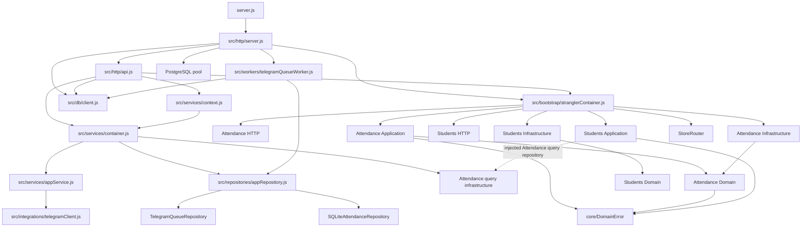

# DONOCRM Architecture Enforcement Report — Phase 1A

Status: Read-only enforcement assessment
Assessment date: 2026-07-22
Scope: Current repository structure and approved architecture documents

Closure note: The Phase 1B authorization dated 2026-07-22 explicitly declares Phase 1A complete. The analytical and planning deliverables are therefore closed; the unresolved gate items recorded below remain valid and are carried into the Phase 1B gate rather than treated as resolved.

Post-review update: On 2026-07-23 the 68-fingerprint baseline was approved and GitHub required check `architecture-enforce-blocking` became active. The historical findings below remain the debt inventory; current enforcement and operational evidence is recorded in [Formal and Operational Gate Closure](formal-operational-gate-closure-2026-07-23.md).

## Executive Summary

The approved architecture is documentable and largely machine-enforceable, but it is not currently enforced by static architecture tests or CI.

The source tree contains 75 JavaScript files and 145 statically resolvable internal CommonJS dependency edges under `src/`. The two physical business modules, Attendance and Students, have no direct module-to-module import. That is a limited strength. Runtime wiring, broad repository ports, and direct SQL still couple them to other bounded contexts:

- Students receives an Attendance query repository directly through bootstrap.
- Attendance repositories read or write Lesson, Group, Schedule, Student, Guardian/Enrollment, Finance, Communications, Audit, and migration tables.
- the Student repository reads Group, Guardian/Enrollment, and Billing tables.
- Presentation imports database, bootstrap, global container, repositories, and concrete infrastructure.
- the only `src/core/` item is an unapproved `DomainError` that carries HTTP status.

The existing `npm run test:architecture` passes, but it runs behavior-focused use-case tests rather than structural enforcement. No repository CI configuration was found.

No application code, API, schema, module, or business behavior was changed during this assessment.

## Audit Basis and Method

Normative sources:

- [Module dependency governance](module-dependencies.md)
- [Coding standards](coding-standards.md)
- [Bounded-context ownership](bounded-contexts.md)
- [ADR-006 Dependency Rule](adrs/ADR-006-dependency-rule.md)
- [ADR-007 Shared Kernel](adrs/ADR-007-shared-kernel.md)
- [Architecture governance](architecture-governance.md)

Repository evidence was collected by:

1. resolving static CommonJS `require()` edges in every `src/**/*.js` file;
2. classifying module files by Domain, Application, HTTP, and Infrastructure path;
3. searching SQL-bearing files and extracting referenced table names;
4. inspecting composition, worker, controller, repository, service, error, and frontend boundaries;
5. measuring line count, function/method concentration, fan-in, and fan-out;
6. running the existing `npm run test:architecture` command;
7. searching common CI configuration locations.

Dynamic imports, runtime object capabilities, SQL assembled beyond recognizable static strings, and semantic behavior require complementary contract tests. Findings do not rely on an absence from static analysis when direct repository evidence exists.

## Enforcement Rule Catalog

“Automatic” means a deterministic test can decide the rule from repository/configuration evidence. “Hybrid” means automation can identify candidates but human or behavioral review must decide semantics.

| ID | Architectural rule | Automatic? | Proposed enforcement tool | Files affected | Current result | Future enforcement strategy |
|---|---|---:|---|---|---|---|
| ER-01 | Domain imports only its own Domain and approved Shared Kernel | Yes | CommonJS dependency graph with path rules | `src/modules/*/domain/**`, `src/core/**` | Violated by Attendance → `DomainError` | Exact forbidden-edge rule; baseline current edge only until corrected |
| ER-02 | Application imports only same-module Domain/Application and approved Shared Kernel | Yes | Dependency graph | `src/modules/*/application/**` | Violated by unapproved `DomainError` imports | Fail new outer/unapproved imports; track known error edges |
| ER-03 | Infrastructure depends inward; Domain/Application never imports concrete adapters | Yes | Dependency graph | module Infrastructure, Domain, Application | No direct Domain/Application → Infrastructure edge found | Immediate fail for new edges |
| ER-04 | Presentation invokes Application, not repositories/database/bootstrap | Yes | Dependency graph plus restricted-import rules | `src/http/**`, `src/modules/*/http/**`, `src/workers/**` | Multiple violations | Baseline exact legacy edges; fail any new shortcut |
| ER-05 | Module graph is acyclic | Yes | Graph strongly-connected-component test | `src/modules/**` and declared public contracts | No direct physical module cycle; semantic repository dependency exists | Include composition-declared runtime edges, not imports alone |
| ER-06 | Cross-module use only public facade/query/event contract | Yes after manifest | Module manifest plus dependency graph | `src/modules/**`, bootstrap | Violated by Students receiving Attendance repository | Declare public surfaces; reject repository-shaped injection |
| ER-07 | Bootstrap alone selects and constructs concrete adapters | Yes | Constructor/import rule | `src/bootstrap/**`, entrypoints, containers/controllers | Violated by legacy container, worker, and repository construction | Allowlisted composition roots; fail construction elsewhere |
| ER-08 | Shared Kernel is minimal and explicitly approved | Yes | File/export allowlist generated from Accepted ADR | `src/core/**` | Violated: `DomainError` is unapproved and HTTP-aware | Empty-by-default manifest; ADR reference required for each export |
| ER-09 | No HTTP, status, SQL, provider, env, filesystem, worker concepts in Domain | Yes | AST/restricted symbol and import scan | module Domain | `DomainError.status` reaches Domain | Fail forbidden modules/symbols and Shared Kernel metadata |
| ER-10 | SQL exists only in owning persistence/reporting adapters | Yes with exclusions | SQL token/AST scan plus table manifest | production `.js` outside migrations/tests | Violated by HTTP and worker SQL | Immediate failure for new SQL outside approved adapter paths |
| ER-11 | A module accesses only owned tables or approved projections | Yes after ownership manifest | SQL table extractor plus ownership registry | persistence/query adapters | Extensively violated in Attendance and Students | Baseline each table edge with mode/read-write and removal owner |
| ER-12 | No module imports another module repository/infrastructure | Yes | Dependency graph | `src/modules/**` | No direct import; one runtime wiring violation | Static fail plus bootstrap wiring contract test |
| ER-13 | Repository ports are capability-focused | Hybrid | Port surface thresholds plus review | module repository ports | Attendance port spans lessons, reasons, finance, alerts, audit | Warn on method count/cross-context vocabulary; Module Owner decides |
| ER-14 | Read/query ports live in Application by default | Yes for placement, hybrid for exception | Path rule plus approved exception | `*QueryRepository*` and query ports | Attendance query port is under Domain | Warning until Module Owner records exception or target placement |
| ER-15 | Equivalent adapters satisfy one contract | Yes behaviorally | Shared contract suite | SQLite/PostgreSQL adapters | Inconsistent `hasActiveSettlement` behavior is visible | Required parity suite before any adapter can be authoritative |
| ER-16 | Migration/store routing is absent from Domain/Application | Yes | Dependency graph and symbol scan | module inner layers | No direct import found | Immediate fail for new edge |
| ER-17 | No direct provider import in Domain/Application | Yes | Restricted import/package rule | module inner layers and legacy services | Extracted modules comply; legacy `AppService` imports Telegram | Fail modules immediately; baseline legacy service edge |
| ER-18 | No new behavior depends on `AppService`/`AppRepository` after migration | Yes after module status manifest | Dependency graph plus diff baseline | all new/migrated code | Legacy API/context/worker still depend on them | Module-status-aware rule; zero tolerance in Active modules |
| ER-19 | No global mutable tenant context | Hybrid | AST scan for module state plus behavior tests | `src/**` | No global tenant variable found; process singletons exist | Fail tenant/user globals; review approved technical singletons |
| ER-20 | Module documentation exists and matches source/ownership | Yes structurally | Markdown/schema/link validator | module docs, source, table manifest | No instantiated module definitions | Require before Module Readiness Gate |
| ER-21 | ADR status and exception lifecycle are valid | Yes | Documentation validator | `docs/architecture/**` | ADR structure/status currently valid; no exception registry exists | Fail invalid status, broken successor, expired exception, missing owner |
| ER-22 | HTTP routes and OpenAPI stay synchronized | Yes with parser | Route inventory plus OpenAPI parser/diff | HTTP routes, `docs/openapi.yaml` | Not enforced by current architecture command | Warning, then fail changed undocumented routes/contracts |
| ER-23 | Architectural checklist evidence accompanies PR/release | Yes in CI workflow | Change-scope detector and required artifact check | PR/release metadata | No CI/workflow evidence found | Required check after CI provider is selected |
| ER-24 | Legacy violations do not grow | Yes | Fingerprinted violation baseline and Git diff | exact recorded edges/table accesses | No approved baseline exists | Architecture Owner approves IDs; CI fails new fingerprints |
| ER-25 | Hotspot size/coupling does not grow unnoticed | Yes as signal | LOC, method count, fan-in/out thresholds | legacy hotspots and new files | Four major god objects identified | Warning only; size alone must not force refactoring |
| ER-26 | One store is authoritative per tenant/data set | Hybrid | Deployment-config validator plus migration tests | store router, relays, runbooks | Routing exists; no governed authority registry | Require signed authority manifest for cutover gates |

## Current Dependency Graph

Arrows are source/runtime dependencies observed in the repository, not target architecture.



## Dependency Violations

| ID | Violation | Repository evidence | Architectural impact | Automatic enforcement |
|---|---|---|---|---|
| DV-01 | Attendance Domain imports an unapproved Shared Kernel error carrying HTTP status | `src/modules/attendance/domain/Attendance.js:1`; `src/core/errors/DomainError.js:2-6` | Domain is transport-aware and Shared Kernel admission is bypassed | ER-01, ER-08, ER-09 |
| DV-02 | Eight Application files import the same unapproved HTTP-aware error | Attendance application validation/create/get/mark/reopen/send/update files at line 1 or 2; `src/modules/students/application/ListStudents.js:1` | Application failures encode presentation status and depend on an unapproved cross-module type | ER-02, ER-08, ER-09 |
| DV-03 | Module controllers import global legacy authentication context | `src/modules/attendance/http/attendanceController.js:2`; `src/modules/students/http/studentController.js:2` | Module presentation is transitively coupled to cookies, global service container, database, and legacy repository | ER-04, ER-18 |
| DV-04 | Legacy API imports concrete database and bootstrap | `src/http/api.js:2-7`; direct calls at `:50-52`, `:65-73`, and router dispatch calls including `:211`, `:423`, `:584` | Presentation bypasses Application and depends backward on composition | ER-04, ER-07, ER-10 |
| DV-05 | HTTP server imports database, worker, bootstrap, and PostgreSQL pool | `src/http/server.js:2`, `:6`, `:8-9`; readiness queries `:22`, `:64-68` | Server adapter also acts as composition and infrastructure coordinator | ER-04, ER-07, ER-10 |
| DV-06 | Legacy service container constructs repositories and migration adapters outside approved bootstrap | `src/services/container.js:1-8`, `:14-24` | A second composition root creates inconsistent dependency selection | ER-07 |
| DV-07 | Legacy repository imports and constructs Attendance infrastructure | `src/repositories/appRepository.js:6`, `:790`, `:4265-4269` | Legacy persistence depends on a module's private adapter and bypasses public Application contracts | ER-06, ER-12, ER-18 |
| DV-08 | Worker directly constructs `AppRepository` and performs SQL | `src/workers/telegramQueueWorker.js:2-3`, `:12-24`, `:33-40`, `:51-52` | Worker presentation owns persistence and cross-context orchestration | ER-04, ER-07, ER-10, ER-18 |
| DV-09 | Legacy Application service imports Telegram provider client | `src/services/appService.js:14`; usage around Telegram settings/test flow | Business orchestration depends directly on external infrastructure | ER-17 |
| DV-10 | Students consumes an Attendance query repository rather than a public module query contract/facade | `src/modules/students/application/ListStudents.js:9-11`, `:25-29`; wired to concrete Attendance adapters by `src/bootstrap/stranglerContainer.js:87-90` | Cross-module dependency is hidden from import graph and couples Students to Attendance persistence selection | ER-05, ER-06, ER-12 |
| DV-11 | `src/http/api.js` owns export query and workbook orchestration | `src/http/api.js:48-81` | Reporting, Student, and Billing responsibilities are embedded in Presentation | ER-04, ER-10 |
| DV-12 | `src/infrastructure/http/StranglerRouter.js` imports the legacy HTTP JSON utility | `src/infrastructure/http/StranglerRouter.js:1` | Adapter packages are coupled by global presentation implementation instead of a clear interface boundary | ER-04 warning; target ownership decision needed |

No direct `attendance` → `students` or `students` → `attendance` source import was found under `src/modules/`. DV-10 proves that import-only enforcement would be insufficient.

## Layer Dependency Graph

The approved architecture does not place Infrastructure “below” Domain as a source dependency. Runtime control can call an adapter through a port, while source dependencies remain inward:

```text
Approved source direction:

Presentation ─────► Application ─────► Domain
Infrastructure ───► Application/Domain ports
Bootstrap ────────► all concrete layers for composition

Approved runtime control:

Presentation → Use Case → Port → Injected Infrastructure Adapter
```

Ports belong to the consumer: aggregate repository ports normally belong to Domain; query/provider/transaction ports normally belong to Application.

## Layer Violations

| ID | Boundary | Evidence | Result |
|---|---|---|---|
| LV-01 | Domain → transport-aware Shared Kernel | `Attendance.js:1`; `DomainError.js:2-6` | Violation |
| LV-02 | Application → transport-aware Shared Kernel | Eight use-case/validation files listed in DV-02 | Violation |
| LV-03 | Presentation → Persistence | `src/http/api.js:3`, `:50-73`; `src/http/server.js:2`, `:64`; `src/workers/telegramQueueWorker.js:2`, `:18`, `:34` | Violation |
| LV-04 | Presentation → Repository implementation | `src/workers/telegramQueueWorker.js:3`, `:13`, `:22`, `:38` | Violation |
| LV-05 | Presentation → Bootstrap | `src/http/api.js:7`; `src/http/server.js:8` | Reverse dependency violation |
| LV-06 | Module Presentation → global legacy container transitively | both module controllers → `src/services/context.js:1-2` → `src/services/container.js` | Violation |
| LV-07 | Legacy Application → external provider | `src/services/appService.js:14` | Infrastructure leak |
| LV-08 | Persistence facade → private module adapter | `src/repositories/appRepository.js:6`, `:790` | Reverse/private dependency violation |
| LV-09 | Query ports placed in Domain | `src/modules/attendance/domain/AttendanceQueryRepository.js:1-9`; `src/modules/students/domain/StudentRepository.js:1-5` serves a list projection | Architecture warning; query ports normally belong to Application |
| LV-10 | Infrastructure duplicates business conflict decisions and HTTP-coded errors | `SQLiteAttendanceRepository.js:390-444`, `:512-538`; corresponding PostgreSQL checks at `PostgresAttendanceRepository.js:288-355`, `:411-464` | Layer duplication/semantic drift risk |

No module Domain/Application import of SQL drivers, filesystem, migration router, or Telegram client was found.

## Shared Kernel Review

`src/core/` contains exactly one file: `src/core/errors/DomainError.js`.

It is not an approved Shared Kernel member under ADR-007, and its constructor includes `status` with default `422` (`DomainError.js:2-6`). It is imported by one Domain file, eight Application files, and two Infrastructure repositories. Static fan-in is 11 files.

Classification: **violation and frozen legacy dependency**. It must not receive new consumers. Phase 1A does not remove or replace it.

`src/utils/` is not treated as Shared Kernel. Its files are legacy/platform utilities. A future rule must prevent Domain/Application from treating that directory as an alternate ungoverned Shared Kernel; current extracted Domain/Application code does not import it.

## Cross-module and Data Ownership Violations

Table ownership is taken from [bounded-contexts.md](bounded-contexts.md). `R` means direct read, `W` direct write, and `I` injected repository/query dependency.

### Module Coupling Matrix

| Consumer/implementation | Attendance | Lesson Delivery | Groups | Scheduling | Students | Guardians/Enrollment | Billing/Ledger | Lesson Finance | Workforce | Communications | Audit | Migration infrastructure |
|---|---:|---:|---:|---:|---:|---:|---:|---:|---:|---:|---:|---:|
| Attendance SQLite command repository | R/W | R/W | R | R | R | R | R | R | R | — | W | W |
| Attendance PostgreSQL command repository | R/W | R/W | R | — | R | R | — | R | R | — | W | W |
| Attendance query repositories | R | R | R | — | R | — | — | — | — | — | — | — |
| Attendance notification repository | — | — | — | — | R | R | — | — | — | W | — | — |
| Students SQLite repository | — | — | R | — | R | R | R | — | — | — | — | — |
| Students Application | I | — | — | — | — | — | — | — | — | — | — | — |
| Legacy AppRepository | R/W | R/W | R/W | R/W | R/W | R/W | R/W | R/W | R/W | R/W | R/W | R/W |

### Concrete ownership findings

| ID | File | Tables/capabilities outside owner | Evidence and impact |
|---|---|---|---|
| CM-01 | `SQLiteAttendanceRepository.js` | lessons/events, groups, schedules, students, guardians/links/enrollments, invoice transactions, finance periods/settlements, teachers, audit, migration outbox | Queries begin at `:134`, roster join at `:148-200`, finance at `:317-333`, alert source at `:336-367`; writes to lessons/events/audit/outbox later in the same 606-line adapter. It is a cross-context repository. |
| CM-02 | `PostgresAttendanceRepository.js` | lessons/events, groups, enrollments, students, finance periods, teachers, audit, migration outbox | Direct joins/writes at `:50-78`, `:220-228`, `:236-261`, `:288-369`, `:411-503`. Target persistence mirrors foreign context data instead of consuming public contracts. |
| CM-03 | Attendance query adapters | lessons, groups, students | `SQLiteAttendanceQueryRepository.js:38-45`, `:134-190`; PostgreSQL equivalent `:72-77`, `:134-186`. Reporting projections directly join context tables. |
| CM-04 | `SQLiteAttendanceNotificationRepository.js` | students, guardian relationships, guardians, messages | `:8-26` resolves recipients and writes Communications data inside Attendance infrastructure. |
| CM-05 | `SQLiteStudentRepository.js` | groups, guardians/relationships, invoice transactions | `:57-86` joins Academic Groups, Guardians/Enrollment, and Billing to build Student results. |
| CM-06 | `ListStudents.js` | Attendance query repository | `:9-11`, `:25-29` calls `studentStats`; bootstrap supplies a concrete store-routed Attendance query repository at `stranglerContainer.js:87-90`. |
| CM-07 | `src/http/api.js` | Student and Billing tables | export SQL at `:50-73` bypasses both modules and Reporting contracts. |
| CM-08 | `telegramQueueWorker.js` | Tenant table and all `AppRepository` capabilities | direct tenant SQL at `:18`, `:34`; broad repository construction at `:13`, `:22`, `:38`. |

### Adapter contract inconsistency

`SQLiteAttendanceRepository.hasActiveSettlement()` queries `lesson_financial_settlements` (`:329-333`). `PostgresAttendanceRepository.hasActiveSettlement()` always returns `false` because settlements remain in SQLite (`:231-233`). Both implement the same Attendance repository contract (`AttendanceRepository.js:10`). This is a concrete parity violation and a high-risk example for ER-15.

### Shared mutable state

No global mutable tenant/user context variable was found. The following process-local singletons/state exist and require explicit platform classification:

- SQLite connection singleton: `src/db/client.js:10-38`.
- PostgreSQL pool singleton: `src/infrastructure/database/postgres/pool.js:1-21`.
- strangler router singleton: `src/bootstrap/stranglerContainer.js:25`, `:31-32`, `:94-97`.
- Telegram worker flags: `src/workers/telegramQueueWorker.js:8-10`, modified by worker execution.
- login rate-limiter map and singleton: `src/security/loginRateLimiter.js:10`, `:66`.
- legacy browser global state: root `app.js:1376`, `:1468-1470`.

Database pools and composition caches may be valid technical singletons. Worker/rate-limit/browser state has multi-process or coupling implications. Automation should flag additions and require an owner rather than forbid all module state indiscriminately.

## Static Analysis and Hotspots

### Dependency metrics

- 75 JavaScript source files under `src/`.
- 145 statically resolved internal CommonJS edges.
- Highest internal fan-out: `src/bootstrap/stranglerContainer.js` with 23 edges; this is expected for composition but must contain no policy.
- Other high fan-out: `src/db/migrationRunner.js` 18, `src/repositories/appRepository.js` 9, `src/http/server.js` 8, `src/services/container.js` 8, and `src/http/api.js` 7.
- Highest fan-in: `src/utils/time.js` 15, `src/core/errors/DomainError.js` 11, `src/utils/id.js` 8, and `src/config/app.js` 7.

### Largest architectural hotspots

| Hotspot | Size/shape | Evidence | Architectural assessment |
|---|---:|---|---|
| `src/repositories/appRepository.js` | 5,411 lines; 163 class-style method declarations; over 40 business tables detected | file and declarations beginning at `:787` | Primary backend god repository; all 17 contexts are represented directly or transitively |
| `src/services/appService.js` | 2,457 lines; 115 class-style method declarations | declarations begin at `:235` and span platform through CRM/import | Primary application god service and cross-context workflow hub |
| root `app.js` | 6,852 lines; approximately 330 top-level function declarations; global state at `:1376` | served as legacy `app.js` by `src/http/static.js:17`, `:30-39` | Legacy frontend god object spanning presentation, state, API calls, and workflows |
| `src/http/api.js` | 723 lines; 98 route equality/match conditions | imports at `:1-7`; route dispatch begins `:84` | Legacy API/router god adapter with authorization, mapping, exports, and dispatch |
| `src/db/schema.js` | 888 lines | source inventory | Central schema ownership across contexts; legacy-compatible but not module-owned |
| `SQLiteAttendanceRepository.js` | 606 lines | direct table evidence in CM-01 | Extracted module adapter remains a cross-context persistence facade |
| `PostgresAttendanceRepository.js` | 509 lines | direct table evidence in CM-02 | Target adapter mirrors foreign context data and has parity drift |
| `src/db/client.js` | 410 lines | initialization `:10-48`; schema repair/backfill through `:408` | Connection, schema, migration, repair, seeding, and business backfill are combined |
| `telegramQueueRepository.js` | 340 lines | imports provider at `:1-6`; multi-table evidence | Persistence, recipient resolution, provider and queue responsibilities are combined |

Size metrics are warning signals, not automatic proof that a refactor is correct. Their principal enforcement use is preventing unreviewed growth.

## Legacy Classification

The three classifications are separate lifecycle properties: current compatibility, migration candidacy, and permission for new development.

| Boundary | Legacy Compatible | Migration Candidate | Forbidden for New Development | Evidence/policy |
|---|---:|---:|---:|---|
| `AppService` | Yes | Yes, context by context | Yes | 2,457-line cross-context service; direct Telegram import |
| `AppRepository` | Yes | Yes, table owner by table owner | Yes | 5,411-line shared repository; private Attendance adapter construction |
| Legacy API `src/http/api.js` | Yes | Yes, route by route | Yes for new business logic/SQL | 98 route conditions, direct SQL and bootstrap/container imports |
| Legacy frontend root `app.js`/`index.html`/`styles.css` | Yes | Yes, page by page | Yes for new cross-context state/workflows | 6,852-line script with global state; root remains served by `static.js` |
| Parallel frontend `public/**` | Compatibility/canary only | Yes | New code must follow page boundaries | 117 lines; `public/app.js:7-8` explicitly identifies strangler status |
| `src/services/container.js` and `context.js` | Yes | Yes | Yes outside compatibility fixes | Second composition root; module controllers import global context |
| `src/db/client.js` and `schema.js` | Yes | Yes, by database ownership | Yes for new business queries/ownership | global SQLite initialization and central schema/migration/backfill |
| Telegram worker/repository/provider chain | Yes | Communications candidate | Yes outside approved adapter boundary | worker constructs `AppRepository`; repository combines provider and tables |
| Attendance module | Partial target/legacy bridge | Yes | New violations forbidden | explicit layers exist, but repository/table/Shared Kernel exceptions remain |
| Students module | Partial target/legacy bridge | Yes | New violations forbidden | one use case; cross-context table and Attendance repository coupling |

“Forbidden for New Development” does not authorize deletion or behavior change. Compatibility/security fixes may touch a legacy file only when the PR proves it does not expand responsibilities or dependency violations.

## Existing Architecture Test Assessment

`package.json` defines:

```text
test:architecture = test-clean-attendance.js && test-student-strangler.js
```

The command passed during this assessment:

- Attendance: 12/12 behavior checks.
- Students: 4/4 behavior/route/source-string checks.

Evidence: `scripts/test-clean-attendance.js:1-169`, `scripts/test-student-strangler.js:1-74`, and `package.json`.

These tests are valuable use-case characterization. They do not build a dependency graph, inspect layer edges, enforce table ownership, validate Shared Kernel membership, detect cycles, or evaluate exception expiry. They must remain behavior tests and should not be represented as complete architecture enforcement.

## Risk Assessment

| Risk | Severity | Evidence | Enforcement response |
|---|---|---|---|
| PostgreSQL and SQLite adapters disagree on active-settlement behavior | Critical | SQLite query vs PostgreSQL hardcoded false described above | Contract test must block PostgreSQL authority/cutover, not change behavior in Phase 1A |
| Cross-context table writes make ownership unenforceable | Critical | Attendance writes Lesson, Communications, Audit, and migration tables; AppRepository spans the system | Table ownership manifest and exact legacy baseline |
| Architecture regression is currently invisible to CI | High | no CI configuration found; current architecture script is behavioral | Provider-neutral CI stages and mandatory structural job |
| Shared Kernel policy is already bypassed by a transport-aware error | High | `DomainError.js` and 11 consumers | Freeze membership and consumers immediately |
| Presentation bypasses Application and composes infrastructure | High | HTTP API/server and Telegram worker evidence | Restricted-import and SQL-placement tests |
| Import-only tests would miss runtime cross-module coupling | High | Students → injected Attendance query repository | Composition/wiring manifest test |
| God service/repository remain easiest place for new behavior | High | AppService/AppRepository concentration | no-growth baseline and changed-line ownership check |
| No named Architecture/Module Owners could approve baselines/exceptions at review time | High | Resolved 2026-07-22 by WF-PRE-01; [architecture governance](architecture-governance.md) now contains the ownership register | Preserve named approval evidence for each baseline and exception |
| Legacy browser state couples all pages and workflows | Medium | root `app.js` metrics and global state | freeze growth; page-level warning metrics |
| Process-local worker/rate-limit state may diverge under horizontal scaling | Medium | worker flags and in-memory rate limiter | state inventory test plus operational decision |
| Static SQL extraction can produce false positives/negatives | Medium | dynamic/template SQL and migration scripts | parser + reviewed table manifest + adapter contract tests |

## Enforcement Findings Summary

- **Direct physical cross-module imports:** none between Attendance and Students.
- **Runtime cross-module repository dependency:** one confirmed Students → Attendance query repository edge.
- **Shared Kernel violations:** one unapproved type with 11 direct consumers.
- **Presentation SQL locations in production:** `src/http/api.js`, `src/http/server.js`, and `src/workers/telegramQueueWorker.js`.
- **Extracted persistence adapters with foreign table access:** all Attendance command/query/notification adapters and the Student SQLite repository.
- **Known reverse/private edges:** HTTP → bootstrap, legacy repository → Attendance infrastructure, legacy context → container, worker → repository.
- **Architecture CI:** absent.
- **Existing architecture-named test:** passes but does not enforce structure.

## Gate Decision

**PHASE 1A INCOMPLETE**

The analysis and enforcement design were complete, but the following blockers prevented Phase 1B at the time of this review:

1. **Resolved 2026-07-22 by WF-PRE-01:** Architecture Owner and relevant Module Owners are assigned to Sukhrob Khaydarov under Single-Founder Governance.
2. No authorized owner has approved the exact legacy-violation baseline or exceptions.
3. No completed module definition establishes authoritative table and public-contract manifests for Attendance or Students.
4. The critical SQLite/PostgreSQL adapter contract discrepancy has no approved gate treatment.
5. The repository has no selected CI provider/configuration or accountable CI owner.
6. There is no approved Phase 1B scope stating which tests will warn, which will fail immediately, and which legacy fingerprints are temporarily tolerated.

WF-PRE-01 resolves item 1 only. Items 2 through 6 remain unresolved and require governance decisions and planning records, not refactoring or module migration. This report does not authorize Phase 1B.
