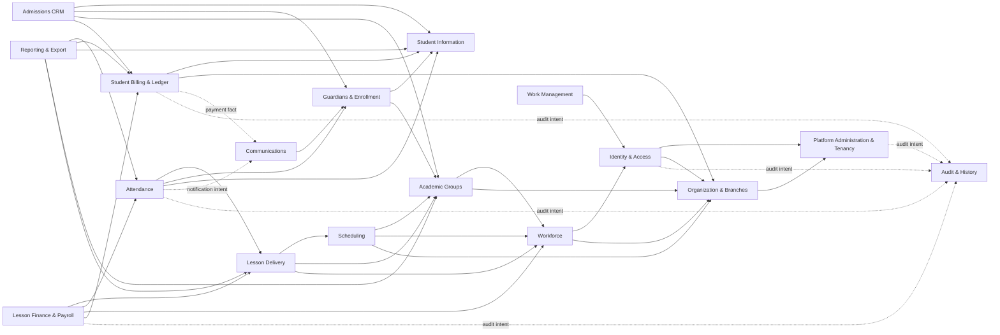

# DONOCRM Bounded Context Map

Status: Architecture Foundation baseline
Related decision: [ADR-005](adrs/ADR-005-bounded-context-strategy.md)

## Purpose and Interpretation

This document maps every business capability evidenced by the current repository into a candidate bounded context. Most boundaries are not yet enforced in code: `src/services/appService.js`, `src/repositories/appRepository.js`, `src/http/api.js`, and `src/db/schema.js` currently span multiple contexts.

The map is therefore both:

- a **current capability inventory**, based on tables, routes, services, workers, tests, and existing documentation; and
- the **approved migration ownership baseline**, subject to refinement by later ADR when product semantics are unresolved.

“Owned data” means target authoritative ownership. During migration, SQLite tables and compatibility projections may temporarily be accessed by legacy code. Such access does not establish permanent shared ownership.

## Extraction Status Vocabulary

| Status | Meaning |
|---|---|
| Extracted | Has explicit Domain/Application/Infrastructure/HTTP structure for its principal flows. |
| Partial | At least one vertical slice is extracted; material behavior remains legacy. |
| Legacy | Capability exists, but ownership is concentrated in shared legacy services/repositories/routes. |
| Cross-cutting legacy | Implemented as shared infrastructure or shared tables without a complete context boundary. |
| Open boundary | Capability exists, but its final context split requires a product/architecture decision. |

## Context Inventory

| # | Bounded context | Current status | Primary evidence |
|---:|---|---|---|
| 1 | Platform Administration & Tenancy | Legacy | `tenants`, platform routes, Super Admin switching |
| 2 | Identity & Access | Legacy | `users`, `sessions`, roles, permissions, branch access |
| 3 | Organization & Branches | Legacy | `branches`, rooms, center settings |
| 4 | Workforce | Legacy | teachers, working hours, employment and portal access |
| 5 | Academic Groups | Legacy | groups, teacher assignments, capacity and archive policy |
| 6 | Scheduling | Legacy | schedules, series lineage, change runs/events, weekly calendar |
| 7 | Lesson Delivery | Legacy | lesson lifecycle, topic, homework, cancellation/restoration |
| 8 | Student Information | Partial | extracted `ListStudents`; remaining student flows legacy |
| 9 | Guardians & Enrollment | Open boundary | guardians, relationships, student-group enrollment history |
| 10 | Attendance | Extracted/transitioning | explicit use cases and SQLite/PostgreSQL adapters |
| 11 | Student Billing & Ledger | Legacy/open boundary | payments, ledger transactions, subscriptions, balances |
| 12 | Lesson Finance & Payroll | Legacy/open boundary | billing policies, settlements, postings, rate rules, accruals |
| 13 | Communications | Legacy | Telegram configuration, linking, queue, retries, worker |
| 14 | Admissions CRM | Legacy | leads, pipeline stages, lead-to-student conversion |
| 15 | Work Management | Legacy | tenant tasks and assignment |
| 16 | Reporting & Export | Cross-cutting legacy | dashboards, profiles, attendance projections, Excel exports |
| 17 | Audit & History | Cross-cutting legacy | audit logs plus context-owned lesson/schedule history |

Migration outbox/inbox, store routing, parity verification, and backfill are platform migration infrastructure, not a business bounded context.

## 1. Platform Administration & Tenancy

**Purpose**
Manage the DONOCRM SaaS platform's tenant accounts and tenant operating state.

**Responsibilities**

- Create and update tenants through Super Admin operations.
- Maintain tenant status, plan, language, domain, and platform-level settings.
- Enter and exit Super Admin tenant mode.
- Seed the minimum tenant foundation currently created with a tenant.

**Owned data**

- `tenants`
- Platform-level portions of `platform_audit_logs` are audited by Audit & History.

**Public API**

- `GET/POST /api/platform/tenants`
- `PATCH /api/platform/tenants/{tenantId}`
- `POST /api/platform/tenants/{tenantId}/users`
- `POST /api/platform/switch-tenant`
- `POST /api/platform/exit-tenant`
- Tenant-status query contract for authenticated use cases

**Dependencies**

- No direct business-module dependency in the target state. Authentication supplies an already verified actor at the interface boundary.
- Tenant provisioning that also creates an administrator or main branch is an outer application workflow; Platform Administration publishes tenant lifecycle facts rather than importing Identity or Organization internals.
- Audit & History for platform actions.

**Future extraction status**
Legacy. Must be separated from tenant business operations. Whether commercial platform subscriptions belong here is open; the BRD states future readiness but no active platform billing.

## 2. Identity & Access

**Purpose**
Authenticate users and authorize access by tenant, role, permission, and eventually branch.

**Responsibilities**

- Login, logout, session lookup, and password change/reset.
- Role and permission resolution.
- Teacher portal access linkage without owning the teacher business profile.
- Tenant and branch authorization context.
- Super Admin effective-role behavior while switched into a tenant.

**Owned data**

- `users`
- `sessions`
- `roles`
- `role_permissions`
- `user_roles`
- `user_branch_access`

**Public API**

- `POST /api/login`, `POST /api/logout`, `GET /api/me`
- `POST /api/settings/password`
- `GET /api/permissions/me`, `GET /api/roles`
- Internal authenticated actor/tenant/branch context
- Identity provisioning invoked by Platform Administration and Workforce

**Dependencies**

- Platform Administration & Tenancy for tenant status and tenant switching.
- Organization & Branches for branch scope.
- Audit & History for security-relevant actions.

**Future extraction status**
Legacy. The final session architecture for horizontal scaling and potential non-browser clients is open.

## 3. Organization & Branches

**Purpose**
Represent the tenant's organizational locations and shared physical resources.

**Responsibilities**

- Center name/settings currently exposed through tenant settings.
- Branch creation, main-branch designation, status, and access references.
- Room identity used by schedules and lessons.

**Owned data**

- `branches`
- `rooms`
- The exact ownership of tenant display settings is shared with Platform Administration today and must be clarified.

**Public API**

- `GET/POST /api/branches`
- Internal branch/room lookup contracts used by Workforce, Groups, Scheduling, and Finance

**Dependencies**

- Platform Administration & Tenancy.
- No direct dependency on Identity & Access in the target state. Interface adapters supply verified authorization context; Identity & Access may reference published branch identities.

**Future extraction status**
Legacy. Branch authorization is modeled but not consistently propagated through normal query context. A dedicated Organization module versus Platform submodule remains an open granularity decision.

## 4. Workforce

**Purpose**
Manage teacher business profiles, employment state, availability, workload inputs, and portal-access coordination.

**Responsibilities**

- Teacher create/update/archive/restore.
- Employment type, branch, specialization, contact details, hire date, workload ceiling.
- Working-hour management.
- Coordinate teacher login provisioning/reset with Identity & Access.
- Provide stable teacher references to Groups, Scheduling, Lessons, and Payroll.

**Owned data**

- `teachers`
- `teacher_working_hours`
- Teacher-side lifecycle of `group_teacher_assignments` is coordinated with Academic Groups; final table ownership is assigned to Academic Groups below.

**Public API**

- `GET/POST /api/teachers`
- `GET/PATCH/DELETE /api/teachers/{teacherId}`
- `POST /api/teachers/{teacherId}/restore`
- `POST /api/teachers/{teacherId}/reset-password`
- `GET/POST/DELETE /api/teacher-working-hours...`
- Internal teacher status/availability/reference contracts

**Dependencies**

- Identity & Access for portal access.
- Organization & Branches.
- Academic Groups, Scheduling, Lesson Delivery, and Lesson Finance consume Workforce contracts.

**Future extraction status**
Legacy. The repository migration order already identifies Teachers as the first reference context after Attendance.

## 5. Academic Groups

**Purpose**
Manage instructional groups and their stable academic/organizational identity.

**Responsibilities**

- Group create/update/archive/restore.
- Group capacity and active-state policy.
- Subject, level, fee/display attributes currently stored on groups.
- Current and historical teacher assignment.
- Provide group references to Enrollment, Scheduling, Lessons, Attendance, and Finance.

**Owned data**

- `groups`
- `group_teacher_assignments`
- Current free-form subject/level fields

**Public API**

- `GET/POST /api/groups`
- `GET/PATCH/DELETE /api/groups/{groupId}`
- `POST /api/groups/{groupId}/restore`
- Group profile and status/capacity reference contracts

**Dependencies**

- Workforce for valid teachers.
- Organization & Branches.
- Membership counts in group-facing views come from a Reporting projection or an outer composition query; Academic Groups does not depend back on Guardians & Enrollment.

**Future extraction status**
Legacy. Whether subject, course, and level become an independent Academic Catalog context is open; the current repository has no course aggregate/table.

## 6. Scheduling

**Purpose**
Own recurring instructional schedules, series evolution, conflict detection, and occurrence intent.

**Responsibilities**

- Weekly schedule rules and validity windows.
- Schedule series identity and version lineage.
- Preview/apply of single-occurrence and future-series changes.
- Teacher, room, group, and student conflict policy.
- Materialization intent for concrete lessons.
- Immutable scheduling history and idempotent schedule changes.

**Owned data**

- `schedules`
- `schedule_change_runs`
- `schedule_events`
- Schedule-side references in concrete lessons, without ownership of the lesson lifecycle

**Public API**

- `GET /api/schedules/week`
- `GET/POST /api/groups/{groupId}/schedules`
- `PATCH/DELETE /api/group-schedules/{id}`
- `POST /api/group-schedules/{id}/changes/preview`
- `POST /api/group-schedules/{id}/changes`
- `POST /api/lesson-occurrences`

**Dependencies**

- Academic Groups, Workforce, Organization & Branches.
- Guardians & Enrollment for student conflict inputs.
- Scheduling publishes occurrence intent; it does not depend on Lesson Delivery. Views that combine schedules and materialized lessons are composed outside the transactional modules.

**Future extraction status**
Legacy. Existing schedule version, history, preview/apply, and finance-isolation behavior in `docs/schedule-series-p1-b.md` is an important invariant source.

## 7. Lesson Delivery

**Purpose**
Own the lifecycle of a concrete delivered or planned lesson.

**Responsibilities**

- Create/materialize, update, cancel, restore, and retrieve lessons.
- Lesson date/time, assigned teacher/room snapshots, topic, homework, and note.
- Lifecycle compatibility between physical `waiting` and exposed `planned` state.
- Coordinate eligibility for Attendance and Lesson Finance without owning their records.

**Owned data**

- `lessons`
- `lesson_events` for lesson lifecycle history, excluding attendance-specific revision facts where context ownership requires a published history contract

**Public API**

- `GET/POST /api/lessons`
- `GET/PATCH /api/lessons/{lessonId}`
- `POST /api/lessons/{lessonId}/cancel`
- `POST /api/lessons/{lessonId}/restore`
- Internal immutable lesson snapshot and lifecycle contracts

**Dependencies**

- Scheduling, Academic Groups, Workforce, Organization & Branches.
- Attendance and Lesson Finance consume Lesson Delivery facts.

**Future extraction status**
Legacy. The current Attendance use cases query lesson state through their broad repository port; this boundary must be made explicit.

## 8. Student Information

**Purpose**
Own the student profile and student lifecycle independent of financial, attendance, and group-membership projections.

**Responsibilities**

- Student identity/profile, status, archive/restore, search, and import coordination.
- Teacher-safe versus administrator projections of student information.
- Stable student references for other contexts.

**Owned data**

- `students`, excluding compatibility fields whose future source belongs elsewhere:
  - `group_id` duplicates current enrollment;
  - `balance`/`debt` duplicate ledger projections;
  - `telegram_chat_id` overlaps Guardian/Communications contact state.

**Public API**

- Extracted: `GET /api/students`
- Legacy: `POST/PATCH/DELETE /api/students...`, profile, restore, import
- Internal student status/reference and privacy-safe query contracts

**Dependencies**

- Organization & Branches.
- Guardians & Enrollment for relationship/membership projections.
- Attendance, Finance, Communications, CRM, and Reporting consume student identity.

**Future extraction status**
Partial. `ListStudents` is explicit and canary-aware; writes and profiles intentionally remain legacy according to `docs/clean-architecture-migration.md`.

## 9. Guardians & Enrollment

**Purpose**
Own guardian-to-student relationships and historical student membership in groups.

**Responsibilities**

- Guardian profile, normalized contact, language, and status.
- Student/guardian relationship, primary/emergency flags, and notification eligibility.
- Student-group enrollment, transfer, completion, withdrawal, dates, and actor history.
- Membership/capacity coordination with Academic Groups.

**Owned data**

- `guardians`
- `student_guardians`
- `student_group_enrollments`

**Public API**

- No independent HTTP API exists today.
- Functionality is embedded in student create/update/profile, Telegram linking, lead conversion, imports, lesson rosters, and group profiles.
- Target public contracts: guardian relationship queries and dated enrollment/membership decisions; exact surface is open.

**Dependencies**

- Student Information.
- Academic Groups.
- Identity & Access for actor identity.
- Communications consumes notification-eligible guardian contacts.

**Future extraction status**
Open boundary. The repository provides distinct tables but combines workflows in `AppRepository`. Whether Guardians and Enrollment become two modules requires later ADR/product review.

## 10. Attendance

**Purpose**
Record and revise a complete lesson attendance decision with explicit reasons and immutable history.

**Responsibilities**

- Lesson attendance roster query.
- Mark/correct attendance for every roster member.
- Attendance-reason configuration and versioning.
- Controlled reopen with finance-period and settlement safeguards.
- Attendance alert candidate preparation.
- Attendance projections and PostgreSQL/SQLite migration parity.

**Owned data**

- `attendance`
- `attendance_reasons`
- `lesson_attendance_revisions`
- Attendance-specific history facts in `lesson_events`
- Temporary migration metadata is infrastructure-owned, not Attendance domain data.

**Public API**

- `GET /api/lessons/{lessonId}/students`
- `POST /api/attendance`
- `POST /api/lessons/{lessonId}/reopen`
- `GET /api/attendance-records`
- `GET/POST/PATCH /api/attendance-reasons...`
- `POST /api/lessons/{lessonId}/send-attendance-alerts`
- Query contracts for student/group attendance projections

**Dependencies**

- Lesson Delivery, Guardians & Enrollment, Student Information, Academic Groups.
- Finance-period and active-settlement checks from financial contexts.
- Communications for alert delivery.
- Audit & History.

**Future extraction status**
Extracted but still transitioning. It has explicit use cases and SQLite/PostgreSQL adapters, but its port combines several external concerns and legacy reference mirroring remains active.

## 11. Student Billing & Ledger

**Purpose**
Own student charges, payments, adjustments, subscriptions, and authoritative balance history.

**Responsibilities**

- Register/update/void payments.
- Append ledger transactions and derive student balances/debt.
- Enforce idempotency and closed-period policy.
- Manage student subscriptions and account/category references currently exposed by finance APIs.
- Publish payment facts for Communications and Reporting.

**Owned data**

- `invoices_transactions`
- `payments`
- `subscriptions`
- `finance_accounts`
- `finance_categories`
- Student `balance` and `debt` columns are compatibility projections, not future authoritative facts.

**Public API**

- `GET/POST /api/payments`, `PATCH/DELETE /api/payments/{paymentId}`
- `GET /api/students/{studentId}/ledger`
- `POST /api/students/{studentId}/transactions`
- `GET/POST /api/subscriptions`
- `GET/POST /api/finance/accounts`
- `GET/POST /api/finance/categories`

**Dependencies**

- Student Information and Organization & Branches.
- Finance-period policy, currently shared with Lesson Finance.
- Communications for receipts.
- Audit & History and Reporting.

**Future extraction status**
Legacy/open boundary. The coexistence of `payments` and `invoices_transactions` requires an explicit accounting ownership decision before extraction.

## 12. Lesson Finance & Payroll

**Purpose**
Convert immutable lesson/attendance facts into controlled student postings and teacher accruals.

**Responsibilities**

- Lesson billing policy and teacher rate rule management.
- Finance-period close/reopen policy used by lesson posting.
- Preview, confirm, and reverse lesson finance.
- Immutable settlement, student posting, run, and teacher accrual history.
- Idempotency, request fingerprint, version, and reversal invariants.

**Owned data**

- `lesson_billing_policies`
- `teacher_rate_rules`
- `finance_periods` (final ownership between financial contexts remains open)
- `lesson_financial_settlements`
- `lesson_financial_runs`
- `lesson_student_postings`
- `teacher_accruals`

**Public API**

- `GET/POST /api/finance/lesson-billing-policies`
- `GET/POST/archive /api/finance/teacher-rate-rules...`
- `GET/POST/close/reopen /api/finance/periods...`
- `GET /api/lessons/{lessonId}/finance-preview`
- `POST /api/lessons/{lessonId}/confirm-finance`
- `POST /api/lessons/{lessonId}/reverse-finance`

**Dependencies**

- Lesson Delivery, Attendance, Student Information, Workforce, Organization & Branches.
- Student Billing & Ledger for monetary postings.
- Audit & History and Reporting.

**Future extraction status**
Legacy/open boundary. Repository evidence contains strong invariants in `docs/lesson-finance-p1.md`, but the BRD originally marked complex accounting/payroll out of v1 scope. Product status and final context split require clarification.

## 13. Communications

**Purpose**
Reliably connect guardians to supported channels and deliver tenant-owned messages.

**Responsibilities**

- Tenant Telegram bot configuration and validation.
- Link token generation/consumption and phone-based guardian linking.
- Queue claim, retry, stale recovery, delivery status, deduplication, and provider calls.
- Telegram update polling and offset management.
- Future channel-neutral notification intent, if additional channels are approved.

**Owned data**

- `messages`
- `outbox` for current payment notification intent; final general outbox ownership is platform infrastructure
- `telegram_link_tokens`
- Telegram settings/update offset currently stored on `tenants`; future ownership must separate platform tenant state from communications configuration

**Public API**

- `GET/POST /api/messages`, process/retry endpoints
- `POST /api/settings/telegram`
- `POST /api/telegram/test`
- `POST /api/students/{studentId}/telegram-link`
- `PATCH /api/students/{studentId}/chat-id`
- Internal notification intent and delivery-status contracts

**Dependencies**

- Platform Administration & Tenancy for tenant configuration.
- Guardians & Enrollment and Student Information for recipients.
- Attendance and financial contexts publish notification intent.
- Telegram Bot API as an external system.

**Future extraction status**
Legacy. The current `TelegramQueueRepository` combines persistence, recipient resolution, message text, token access, polling, and provider calls.

## 14. Admissions CRM

**Purpose**
Track prospective students and convert accepted leads into operational student records.

**Responsibilities**

- Lead lifecycle and pipeline-stage configuration.
- Responsible administrator, next action, source, note, and lost state.
- Idempotent or otherwise controlled lead-to-student conversion; exact consistency policy is open.

**Owned data**

- `leads`
- `pipeline_stages`

**Public API**

- `GET/POST /api/leads`
- `PATCH /api/leads/{leadId}/stage`
- `POST /api/leads/{leadId}/convert`
- `GET/POST/PATCH/DELETE /api/pipeline-stages...`

**Dependencies**

- Identity & Access for responsible administrators.
- Student Information, Guardians & Enrollment, Academic Groups, and Student Billing during conversion.

**Future extraction status**
Legacy. Lead conversion currently writes several contexts inside one repository transaction; the target workflow consistency model requires an ADR.

## 15. Work Management

**Purpose**
Manage tenant-scoped administrative and teacher tasks.

**Responsibilities**

- Task creation, assignment, priority, due date, completion, and archive state.
- Reference related business entities without owning them.
- Role-specific visibility/update policy.

**Owned data**

- `tasks`

**Public API**

- `GET/POST /api/tasks`
- `PATCH /api/tasks/{taskId}`

**Dependencies**

- Identity & Access for author/assignee.
- Other contexts only by stable related identifiers.

**Future extraction status**
Legacy. Whether this remains an independent module or becomes a platform collaboration capability is open.

## 16. Reporting & Export

**Purpose**
Provide dashboards, cross-context projections, bounded histories, and export representations without owning transactional facts.

**Responsibilities**

- Admin and teacher dashboards.
- Student/group profiles composed from multiple contexts.
- Attendance statistics and histories.
- Payment/student Excel exports.
- Read-model freshness, pagination, and privacy-safe projections.

**Owned data**

- No authoritative transactional tables today.
- Future projection tables/materialized views may be owned by Reporting after an explicit design.

**Public API**

- `GET /api/bootstrap`
- Profile/list/dashboard projections
- `GET /api/export/students`
- `GET /api/export/payments`

**Dependencies**

- Published query contracts or events from all relevant contexts.
- Identity & Access for projection authorization.

**Future extraction status**
Cross-cutting legacy. Current dashboards and profiles are built in `AppRepository`; exports issue SQL directly in `src/http/api.js`.

## 17. Audit & History

**Purpose**
Provide immutable evidence of security- and business-significant changes while respecting context-owned domain history.

**Responsibilities**

- Platform and tenant audit records.
- Stable actor, tenant, action, entity, time, and metadata conventions.
- Retention and access policy, which remains open.
- Accept audit intent from contexts without becoming the owner of their domain state.

**Owned data**

- `audit_logs`
- `platform_audit_logs`
- `lesson_events` and `schedule_events` remain owned by their business contexts even if exposed through an audit view.

**Public API**

- `GET /api/platform/audit-logs`
- Tenant audit information currently returned through bootstrap
- Internal append-audit port

**Dependencies**

- Identity & Access and Platform Administration for actor/tenant identity.
- Consumes audit intent from every context.

**Future extraction status**
Cross-cutting legacy. Current audit calls are embedded in repositories/use cases, and metadata/retention policy is incomplete.

## Context Relationship Diagram

Target logical relationships; arrows point from consumer to provider for synchronous use, while dashed arrows represent published facts/notification intent.

## External Systems and C4 Context

At C4 System Context level:

- Super Admin, tenant Admin, and Teacher interact with the DONOCRM Software System through its browser interface.
- Parent is an external notification recipient, not an authenticated system role in the BRD.
- Telegram Bot API is the only implemented external business integration.
- PostgreSQL and SQLite are containers/data stores within the DONOCRM system boundary, not external business systems.

SMS, email, payment gateways, mobile applications, parent portals, and other third-party integrations are not implemented and are not assumed by this context map.

## Open Context Decisions

1. Separate Guardians and Enrollment or retain one context.
2. Introduce an Academic Catalog for course/subject/level or keep those concepts within Groups.
3. Separate Finance Periods and finance dictionaries into a Finance Core context.
4. Split Student Billing, Ledger, Lesson Finance, and Payroll more finely.
5. Decide whether Work Management is a domain context or platform capability.
6. Define ownership of tenant Telegram configuration currently stored on `tenants`.
7. Define the authoritative representation replacing `students.group_id`, `students.balance`, `students.debt`, and duplicated Telegram chat state.
8. Define cross-context consistency for onboarding, lead conversion, payment notification, and lesson settlement.
